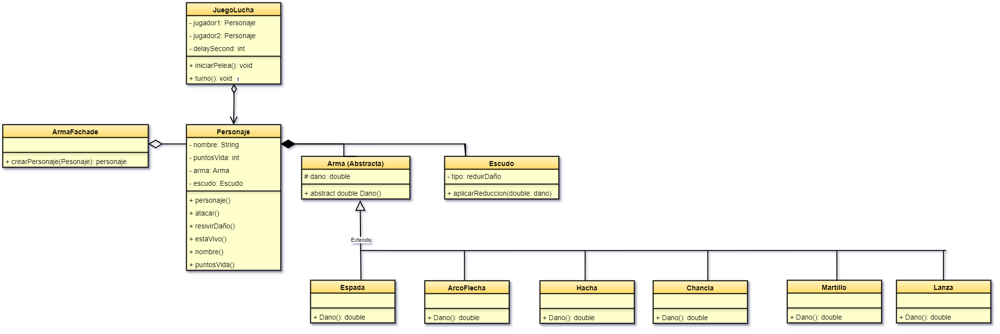

# Proyecto: Lucha de Espartanos

## Introducción
El proyecto "Lucha de Espartanos" es un juego de combate en el que dos personajes, conocidos como espartanos, se enfrentan utilizando ataques físicos. Los personajes pueden equiparse con diferentes armas que aumentan su capacidad de daño y escudos que les permiten reducir el daño recibido. Este proyecto implementa el uso de patrone Facade.

## Objetivos del Proyecto
- Crear un juego interactivo de combate entre personajes.
- Incorporar armas y escudos con efectos significativos en el combate.
- Aplicar el patrón de diseño Facade para simplificar la creación y configuración de personajes.

## Diagrama:  

## Diseño del Sistema
### Clases Principales
El sistema está compuesto por las siguientes clases principales:

- **Personaje**: Representa a un espartano en el juego. Tiene atributos como nombre, puntos de vida, arma equipada y escudo.
- **Armas**: Clases abstractas que representan diferentes tipos de armas (Arco/Flecha, Espada, Lanza, Chancla, Hacha, Martillo) con sus respectivos aumentos de daño.
- **Escudo**: Clase que representa un escudo que reduce el daño de los ataques recibidos.
- **JuegoLucha**: Clase responsable de manejar el ciclo de combate entre dos personajes.
- **JuegoFacade**: Implementa el patrón de diseño Facade, simplificando la creación de personajes con armas y escudos.

## Implementación Técnica
### Clases de Armas y Escudos
Las distintas armas añaden un nivel adicional de daño, mientras que el escudo permite a los personajes mitigar parte del daño recibido. La implementación permite que un personaje tenga un arma, un escudo o ambos, proporcionando flexibilidad y profundidad en el combate.

### Implementación del Patrón Facade
El uso del patrón de diseño Facade en la clase `JuegoFacade` facilita la creación de personajes y sus equipamientos. En lugar de lidiar con la creación de personajes, armas y escudos de manera independiente, el jugador interactúa con un método simplificado que realiza estas configuraciones detrás de escena.

## Flujo del Juego
El juego sigue un flujo básico:

1. **Inicialización**: Los jugadores introducen los nombres de los espartanos, eligiendo el tipo de arma y si desean un escudo.
2. **Combate**: Los personajes alternan turnos en los que atacan al oponente, mostrando los puntos de vida y el daño causado.
3. **Final del juego**: Cuando uno de los espartanos se queda sin puntos de vida, se declara al otro como ganador.

- **Mantenimiento**: Gracias al uso del patrón Facade, la base del código es más fácil de mantener y modificar, lo que facilita la implementación de nuevas características.

## Explicación Paso a Paso  

### Clase Personaje y Métodos  
La clase **Personaje** representa a un espartano en el juego, almacenando su nombre y puntos de vida.   
- El método `atacar(Personaje oponente)` permite a un personaje atacar al oponente, restando puntos de vida de manera aleatoria en función del daño del arma equipada.  
- El método `recibirDano(dano: int)` actualiza los puntos de vida del personaje después de recibir el daño.  
- El método `estaVivo()` retorna un valor booleano indicando si el personaje todavía tiene puntos de vida.   
- Los métodos `getNombre()` y `getPuntosDeVida()` retornan el nombre del personaje y sus puntos de vida actuales, respectivamente.  

### Clase Arma  
La clase **Arma** define las características de las armas que los personajes pueden usar.  
- Cada arma tiene un nombre y un valor de daño asociado.  
- El método `getDanio()` retorna el daño que puede infligir el arma.  

### Clase Escudo  
La clase **Escudo** se encarga de la defensa del personaje.  
- Los escudos tienen un valor de reducción que disminuye el daño recibido.  
- El método `aplicarReduccion(dano: int)` calcula el daño después de aplicar la reducción del escudo.  

### Clase JuegoLucha y Flujo del Juego  
La clase **JuegoLucha** es responsable de gestionar el flujo del combate entre dos personajes.  
- El método `iniciarPelea()` activa un ciclo que alterna turnos de ataque hasta que uno de los personajes pierda todos sus puntos de vida.  
- Durante cada turno, un personaje ataca al oponente, se actualizan los puntos de vida, y se verifica si alguno ha sido derrotado.  

### Uso de Armas y Escudos  
La implementación de armas y escudos añade un nivel estratégico al combate.  
- Cada arma tiene un daño asignado que se suma al ataque del personaje.  
- El escudo puede reducir una parte del daño recibido, lo cual es calculado en el método `aplicarReduccion(dano: int)` de la clase **Escudo**.  

### Condicionales y Ciclos  
El ciclo `while` en el método `iniciarPelea()` asegura que el combate continúe mientras ambos personajes estén vivos.  
- Las condicionales determinan el resultado de cada ataque y verifican si algún personaje ha muerto, permitiendo que el juego declare un ganador al final del combate.
